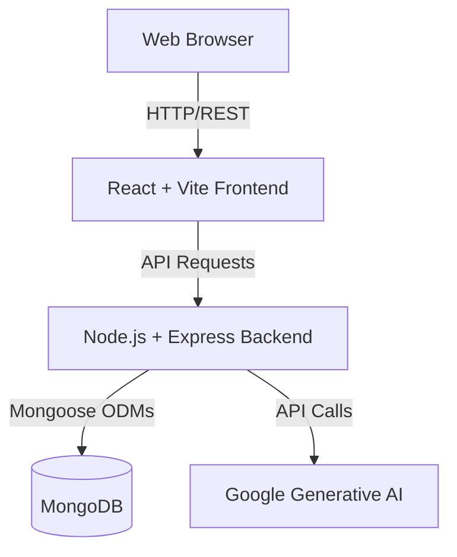

# Architecture Overview

The Gen-AI application is built using a modern JavaScript full-stack architecture, strongly resembling the MERN stack with the addition of Google's Generative AI capabilities.

## High-Level Architecture

## Frontend Architecture

The frontend is a Single Page Application (SPA) located in the `frontend` directory.

*   **Framework**: React 19 driven by Vite for fast builds and HMR.
*   **Routing**: React Router 7 setup for client-side navigation.
*   **State Management/Data Fetching**: Axios is used for API requests.
*   **Styling**: SASS/SCSS.
*   **Structure**: Feature-based architecture (`src/features/...`).

## Backend Architecture

The backend is a RESTful API built with Node.js and Express.

*   **Server Core**: Express.js handling routing and middleware.
*   **Database**: MongoDB with Mongoose for Object Data Modeling (models for `User`, `InterviewReport`, `Blacklist`, etc.).
*   **Authentication & Security**: JSON Web Tokens (JWT) stored via cookies, password hashing with `bcryptjs`.
*   **AI Integration**: Utilizes `@google/genai` for core generative features, residing mostly within `src/services/ai.service.js`.
*   **Validation**: Zod is used for schema validation.
*   **Utilities**: `multer` for handling file uploads, and `puppeteer` available for advanced scraping/automation tasks if needed.

## Directory Flow

1.  **Routes**: (`src/routes`) - Define API endpoints and map them to controllers.
2.  **Controllers**: (`src/controllers`) - Extract request parameters, call services, and return HTTP responses.
3.  **Services**: (`src/services`) - Contain core business logic (e.g., AI interactions).
4.  **Models**: (`src/models`) - Define MongoDB schemas and interact with the database.
5.  **Middlewares**: (`src/middlewares`) - Handle cross-cutting concerns like authentication and error handling before requests hit controllers.
